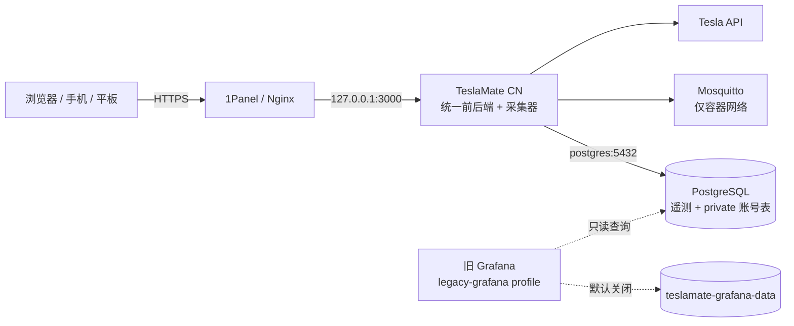

# TeslaMate CN

**面向多用户的 Tesla 车辆数据平台：采集、登录、车辆授权、轨迹、电池、充电与分析统一运行在一个 Web 应用中。**

[](https://github.com/kafuunochino/teslamate/actions/workflows/devops.yml)
[](https://github.com/kafuunochino/teslamate/actions/workflows/ghcr_build.yml)
[](https://github.com/kafuunochino/teslamate/actions/workflows/osv-scanner.yml)
[](LICENSE)

[无损升级指南](UPGRADE.zh-CN.md) · [权限与安全模型](PLATFORM_SECURITY.zh-CN.md) · [English](README.en.md)

## 项目定位

TeslaMate CN 基于 [TeslaMate](https://github.com/teslamate-org/teslamate) 的车辆采集器和 PostgreSQL 遥测模型，重新构建了适合家庭、车队或受控共享场景的中文多用户前端。

它不是简单的 Grafana 主题，也不再依赖 TeslaMate 4000 端口给 Grafana 提供认证代理。登录、注册、车辆授权、首页、轨迹、电池、充电和分析均由 Phoenix LiveView 应用直接提供。

> [!IMPORTANT]
> 这是独立维护的衍生项目，不是 Tesla、TeslaMate 官方服务，也不提供官方车辆诊断、保险评分或驾驶安全结论。

> [!CAUTION]
> 平台保存车辆精确位置、完整轨迹和加密的 Tesla API Token。生产环境只能将应用绑定到 `127.0.0.1:3000`，公网必须通过 HTTPS 反向代理访问。不要直接公开 PostgreSQL、MQTT、旧 Grafana 或 4000 端口。

## 核心能力

- **统一首页**：车辆状态、当前电量、预计续航、累计里程、海拔、温度、软件版本、位置、近期行程与充电。
- **行程轨迹**：路线地图、里程、时长、速度、海拔变化、常去地点，以及经过车辆权限校验的 GPX 导出。
- **电池与能效**：归一化满电额定续航趋势、统计变化、能耗、充电累计和胎压。统计估算不会冒充官方 BMS 检测。
- **充电与费用**：充电会话、电网取电、充入电量、时长、费用、平均电价和常用充电地点。
- **分析与建议**：月度里程、能效、短途/夜间出行和充电习惯，以可解释规则生成建议。
- **多用户账号**：支持注册、密码登录、资料修改、会话管理、账号停用和角色控制。
- **车辆级权限**：管理员可查看全部车辆；普通用户只能访问被明确授权或认领的车辆。
- **安全车辆绑定**：管理员生成一次性限时认领码；数据库只保存哈希，原文仅显示一次。
- **响应式 UI**：桌面端左侧导航，手机和平板自动切换为抽屉菜单和移动卡片布局。
- **旧数据兼容**：继续使用原有车辆、行程、位置、充电、地址、地理围栏和 Tesla Token，不重新初始化遥测数据库。

## 页面分类

| 分类       | 主要内容                                                   |
| ---------- | ---------------------------------------------------------- |
| 首页       | 实时状态、电量、续航、里程、位置、海拔、环境数据和近期活动 |
| 行程轨迹   | 行程列表、单次轨迹、速度、能耗、海拔和 GPX 导出            |
| 电池       | 满电续航趋势、电池统计、能效、充电累计和胎压               |
| 充电       | 充电记录、电量、时长、费用、电价和地点分布                 |
| 分析       | 出行习惯、月度里程、短途/夜间比例、能效评分与建议          |
| 车辆中心   | 车辆绑定、认领码兑换和个人车辆权限                         |
| 用户与权限 | 管理员管理账号、角色、状态、车辆授权和认领码               |
| 系统管理   | Tesla 连接、采集器、设置、地理围栏和数据导入               |

## 权限模型

| 能力                      |   未登录   |  普通用户  |  管理员  |
| ------------------------- | :--------: | :--------: | :------: |
| 注册账号                  | 开关启用时 |     —      |    —     |
| 登录和修改自己的资料      |     否     |     是     |    是    |
| 查看车辆数据              |     否     | 仅绑定车辆 | 全部车辆 |
| 查看行程详情和导出 GPX    |     否     | 仅绑定车辆 | 全部车辆 |
| 兑换车辆认领码            |     否     |     是     | 无需兑换 |
| 授予或撤销车辆权限        |     否     |     否     |    是    |
| 管理 Tesla Token 和采集器 |     否     |     否     |    是    |
| 调用车辆采集控制 API      |     否     |     否     |    是    |

新注册用户默认拥有 **0 辆车辆**。平台不会根据 VIN、车名、车牌、邮箱或“第几辆车”自动推断归属。每次数据查询、行程详情和 GPX 下载都会在服务端重新执行车辆权限检查，不能依靠修改 URL 访问其他用户车辆。

平台账号与 Tesla 采集身份相互独立：当前一个部署实例使用一套全局采集器和数据库，再把已采集车辆按权限分配给平台用户。普通用户不会获得 Tesla access/refresh token，也不能连接自己的 Tesla 账号或控制采集器。

## 系统架构



| 组件                     | 默认行为                                                     |
| ------------------------ | ------------------------------------------------------------ |
| `teslamate`              | 采集器、统一前后端、登录与权限；容器及宿主机均使用 3000      |
| PostgreSQL               | 1Panel 部署连接现有 `postgres:5432`，不会新建或替换数据库    |
| `mosquitto`              | 仅在 Docker 网络内使用，不发布宿主机端口                     |
| `grafana`                | 仅作为 `legacy-grafana` 兼容 profile，默认不启动且不发布端口 |
| `teslamate-grafana-data` | 保留原卷名和数据，不删除、不重新初始化                       |

默认网络边界：

```text
Internet ──HTTPS──> 1Panel/Nginx ──HTTP──> 127.0.0.1:3000
```

宿主机不应再监听 TeslaMate 4000。

## 选择部署方式

### 从现有 1Panel 部署升级

适用于已经运行以下架构的服务器：

- Grafana：`127.0.0.1:3000`
- TeslaMate：`127.0.0.1:4000`
- 外部 PostgreSQL：`postgres:5432`
- 1Panel/Nginx：代理到 `127.0.0.1:3000`

请严格按照 [1Panel 无损升级指南](UPGRADE.zh-CN.md) 操作。升级会先备份 PostgreSQL、`.env`、Compose 和 Grafana 卷信息，再停止旧 Grafana 释放 3000，最后启动统一应用。

不要直接执行：

```bash
git pull && docker compose up -d --build
```

更不要执行：

```bash
docker compose down -v
docker volume rm teslamate-grafana-data
rm -rf /var/lib/grafana
```

升级的重要保证：

- 不修改 `ENCRYPTION_KEY`、`DATABASE_PASS`、`DATABASE_HOST` 或 `DATABASE_NAME`；
- 不新增或替换外部 PostgreSQL；
- 只新增 `private.users`、`private.user_sessions`、`private.user_cars`、`private.vehicle_claims` 和 `private.audit_events`；
- 不删除车辆、行程、位置、充电、地址或地理围栏；
- `teslamate-grafana-data` 原样保留；
- Nginx 上游继续使用 `http://127.0.0.1:3000`；
- 数据库迁移由新容器入口脚本自动执行。

### 全新 Docker Compose 安装

全新安装可使用包含 PostgreSQL 的 `docker-compose.zh-CN.yml`。

1. 准备环境变量：

   ```bash
   cp .env.example .env
   chmod 600 .env
   ```

2. 分别生成三个长期保存且互不相同的随机值：

   ```bash
   openssl rand -base64 64  # ENCRYPTION_KEY
   openssl rand -base64 64  # SECRET_KEY_BASE
   openssl rand -base64 32  # SIGNING_SALT
   ```

   将输出写入 `.env`，并设置强 `DATABASE_PASS`。不要把 `.env` 提交到 Git。

3. 构建并启动：

   ```bash
   TESLAMATE_REVISION="$(git rev-parse HEAD)" \
     docker compose -f docker-compose.zh-CN.yml \
     up -d --build teslamate mosquitto database
   ```

4. 创建首个平台管理员：

   ```bash
   read -r -p '管理员邮箱: ' ADMIN_EMAIL
   read -r -s -p '管理员新密码（至少 12 位）: ' ADMIN_PASSWORD
   printf '\n'

   docker compose -f docker-compose.zh-CN.yml exec \
     -e TESLAMATE_ADMIN_EMAIL="$ADMIN_EMAIL" \
     -e TESLAMATE_ADMIN_PASSWORD="$ADMIN_PASSWORD" \
     -e TESLAMATE_ADMIN_NAME="平台管理员" \
     teslamate bin/teslamate eval 'TeslaMate.Release.create_admin_from_env()'

   unset ADMIN_PASSWORD
   ```

5. 访问 `http://127.0.0.1:3000/sign_in`。公网部署必须先配置 HTTPS 反向代理。

## 关键环境变量

| 变量                             | 说明                                        | 1Panel 建议值        |
| -------------------------------- | ------------------------------------------- | -------------------- |
| `ENCRYPTION_KEY`                 | 加密 Tesla Token，已有部署绝不能重新生成    | 保留原值             |
| `SECRET_KEY_BASE`                | Cookie 和平台会话签名密钥                   | 独立随机值           |
| `SIGNING_SALT`                   | LiveView 签名盐                             | 独立随机值           |
| `DATABASE_HOST`                  | PostgreSQL 主机                             | `postgres`           |
| `DATABASE_PORT`                  | PostgreSQL 端口                             | `5432`               |
| `PANEL_NETWORK`                  | PostgreSQL 和应用共同使用的外部 Docker 网络 | `1panel-network`     |
| `VIRTUAL_HOST`                   | 公网域名，不包含协议                        | 实际域名             |
| `CHECK_ORIGIN`                   | 允许的浏览器 Origin                         | `https://实际域名`   |
| `TESLAMATE_TRUSTED_PROXIES`      | 可以信任转发头的反向代理 IP/CIDR            | 实际代理容器地址     |
| `TESLAMATE_ALLOW_SIGN_UP`        | 是否开放普通用户注册                        | 首次部署先设 `false` |
| `TESLAMATE_ACCOUNT_SESSION_DAYS` | 登录会话期限，最大 90 天                    | `30`                 |

完整示例和防爆破参数见 [.env.example](.env.example)。

## 注册与车辆绑定

1. 首次部署将 `TESLAMATE_ALLOW_SIGN_UP=false`，先创建并验证管理员。
2. 需要开放注册时改为 `true`，然后只重新创建 `teslamate` 服务。
3. 用户在 `/register` 注册后默认看不到任何车辆。
4. 管理员在“用户与权限”中直接授权，或为指定车辆生成 1、8、24、72 小时认领码。
5. 通过可信渠道把认领码原文发送给用户；不要放入公开群聊、截图或日志。
6. 用户在“车辆中心”兑换后，只获得该车辆的只读数据权限。
7. 用户解绑或管理员撤销授权只删除权限关系，不会删除车辆及其历史数据。

当前没有邮件验证、自助密码找回和 MFA。若平台开放到公网，应限制管理员入口、使用密码管理器生成的独立强密码，并考虑在 Nginx/Cloudflare 前增加额外身份验证。

## HTTPS 反向代理

1Panel/Nginx 上游保持：

```text
http://127.0.0.1:3000
```

代理至少需要转发：

```text
Host
X-Forwarded-Proto
X-Forwarded-For
Upgrade
Connection
```

生产 `.env` 示例：

```dotenv
VIRTUAL_HOST=car.example.com
CHECK_ORIGIN=https://car.example.com
TESLAMATE_TRUSTED_PROXIES=172.18.0.0/16
TESLAMATE_API_ORIGIN_CHECK=true
```

浏览器会话 Cookie 在生产镜像中使用 `Secure`、`HttpOnly` 和 `SameSite=Strict`。反向代理负责 HTTP 到 HTTPS 跳转；确认域名永远只提供 HTTPS 后再启用 HSTS。

## 创建或重置平台管理员

该命令可重复执行。邮箱已存在时会恢复管理员状态并更新密码，密码不会写入 Git：

```bash
COMPOSE_FILE=docker-compose.1panel.yml

read -r -p '管理员邮箱: ' ADMIN_EMAIL
read -r -s -p '管理员新密码（至少 12 位）: ' ADMIN_PASSWORD
printf '\n'

docker compose -f "$COMPOSE_FILE" exec \
  -e TESLAMATE_ADMIN_EMAIL="$ADMIN_EMAIL" \
  -e TESLAMATE_ADMIN_PASSWORD="$ADMIN_PASSWORD" \
  -e TESLAMATE_ADMIN_NAME="平台管理员" \
  teslamate bin/teslamate eval 'TeslaMate.Release.create_admin_from_env()'

unset ADMIN_PASSWORD
```

## 日常更新

现有 1Panel 部署第一次迁移前必须使用 [无损升级指南](UPGRADE.zh-CN.md)，不能直接套用本节。

完成统一平台迁移后的日常更新：

```bash
cd /opt/teslamate-cn
git status --short
git fetch origin
git pull --ff-only origin main

docker compose -f docker-compose.1panel.yml config

TESLAMATE_REVISION="$(git rev-parse HEAD)" \
  docker compose -f docker-compose.1panel.yml build --no-cache teslamate

docker compose -f docker-compose.1panel.yml \
  up -d --force-recreate teslamate

docker compose -f docker-compose.1panel.yml ps
docker compose -f docker-compose.1panel.yml logs --tail=200 teslamate
```

如果 `git status` 有未知修改，或 `git pull --ff-only` 被拒绝，应停止更新并检查，不要使用 `git reset --hard`。

## 运行验证

```bash
COMPOSE_FILE=docker-compose.1panel.yml

docker compose -f "$COMPOSE_FILE" ps
docker compose -f "$COMPOSE_FILE" logs --tail=200 teslamate

curl -fsS -o /dev/null -w '%{http_code}\n' \
  http://127.0.0.1:3000/sign_in

curl -sS -o /dev/null -D - \
  http://127.0.0.1:3000/ | sed -n '1,10p'

ss -ltn | grep -E '127\.0\.0\.1:(3000|4000)'
```

预期：

- `/sign_in` 返回 200；
- 未登录 `/` 跳转到 `/sign_in`；
- 只有 `127.0.0.1:3000`，没有 4000；
- 默认 Compose 服务中没有运行 Grafana；
- 公网 HTTPS 域名显示统一平台登录页。

## 旧 Grafana 数据

统一平台默认不使用 Grafana，但会永久保留 `teslamate-grafana-data` 卷的兼容声明。需要迁移期检查或导出旧内容时，可以临时启动不发布宿主机端口的 profile：

```bash
docker compose -f docker-compose.1panel.yml \
  --profile legacy-grafana up -d grafana

docker compose -f docker-compose.1panel.yml \
  --profile legacy-grafana logs --tail=100 grafana
```

已有数据卷不会因为环境变量变化而修改管理员密码。Grafana 13 可使用：

```bash
docker compose -f docker-compose.1panel.yml \
  --profile legacy-grafana exec grafana \
  grafana cli admin reset-admin-password '新的强密码'
```

使用完成后只停止并移除容器，不能删除卷：

```bash
docker compose -f docker-compose.1panel.yml \
  --profile legacy-grafana stop grafana

docker compose -f docker-compose.1panel.yml \
  --profile legacy-grafana rm -f grafana
```

## 数据迁移与回滚

账号迁移只新增 `private` schema 表，不修改原遥测表。旧版本会忽略这些新增表，因此应用回滚通常不需要删除表或恢复数据库。

标准回滚使用升级前保存的 Git 提交、`.env` 和 Compose 副本。不要默认恢复 PostgreSQL 备份，因为这会丢失备份后新增的车辆遥测。完整命令见 [无损升级指南的回滚章节](UPGRADE.zh-CN.md#八回滚不删除任何卷)。

## 安全与隐私

- 密码使用 PBKDF2-HMAC-SHA256、每用户随机盐和 600,000 次迭代。
- 会话 Token 和车辆认领码在数据库中只保存 SHA-256 哈希。
- 登录与注册带按 IP、邮箱的速率限制；生产环境还应在反向代理/WAF 配置限流。
- 角色、账号状态或密码变化会撤销相关会话。
- 最后一个有效管理员不能被停用或降级。
- 普通用户无法读取 Tesla Token、管理采集器或调用车辆控制 API。
- 管理员是高信任角色，可以查看全部车辆精确位置和历史轨迹，应严格控制数量。
- 地图瓦片默认来自 OpenStreetMap，瓦片服务会看到客户端请求的近似区域。

完整权限矩阵、威胁边界、审计事件和当前限制见 [权限与安全模型](PLATFORM_SECURITY.zh-CN.md)。

## 技术栈与目录

| 路径                        | 作用                                          |
| --------------------------- | --------------------------------------------- |
| `lib/teslamate`             | Tesla 采集器、账号上下文、车辆权限和数据查询  |
| `lib/teslamate_web`         | Phoenix、LiveView、登录、管理后台和响应式页面 |
| `priv/repo/migrations`      | PostgreSQL 增量迁移                           |
| `assets`                    | CSS、JavaScript、地图和交互 Hook              |
| `grafana`                   | 默认关闭的旧 Grafana 兼容镜像和仪表板         |
| `docker-compose.1panel.yml` | 连接外部 PostgreSQL 的 1Panel 生产部署        |
| `docker-compose.zh-CN.yml`  | 包含 PostgreSQL 的全新 Docker 安装            |
| `test`                      | 账号、会话、权限、采集器和 Web 测试           |

主要技术：Elixir、Phoenix、Phoenix LiveView、Ecto、PostgreSQL、Docker Compose、Mosquitto、Leaflet 和原生响应式 CSS。

## 质量检查

GitHub Actions 会执行：

- Elixir 编译与完整测试；
- Dialyzer 静态分析和未使用依赖检查；
- Nix/treefmt 格式检查；
- 简体中文可见文本和翻译审计；
- Grafana 仪表板校验；
- 1Panel Compose 模型和统一应用 Docker 镜像构建；
- amd64/arm64 GHCR 镜像构建；
- OSV 依赖漏洞扫描。

本地可执行：

```bash
node scripts/validate-china-dashboards.mjs
node scripts/audit-visible-text.mjs --check --sql-aliases
node scripts/audit-zh-hans-translations.mjs
git diff --check
```

## 当前限制与路线图

- 增加邮件验证、邀请邮件和自助密码找回；
- 支持 MFA/Passkey；
- 将单实例 ETS 登录限流迁移到共享存储；
- 支持自托管地图瓦片，减少位置元数据外泄；
- 增加更完整的审计查询、数据导出和通知；
- 在严格隔离采集凭据的前提下评估多 Tesla 账号/多租户采集。

## 上游与许可证

本项目保留并持续同步 TeslaMate 的采集能力与兼容迁移，同时独立维护中文多用户平台。提交上游兼容更新时，必须确保车辆权限、外部 PostgreSQL、单端口网络边界和现有数据安全不被破坏。

项目使用 [GNU Affero General Public License v3.0](LICENSE)。公开部署修改后的版本时，请遵守 AGPL-3.0 的源代码提供义务。
